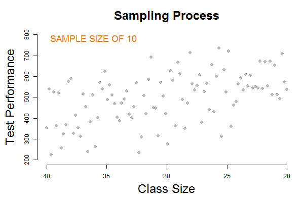
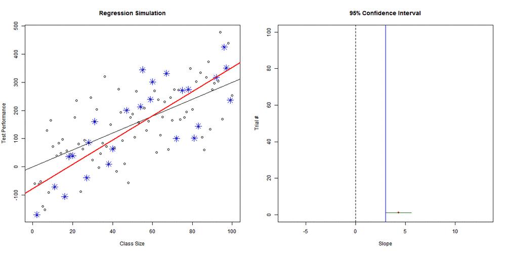
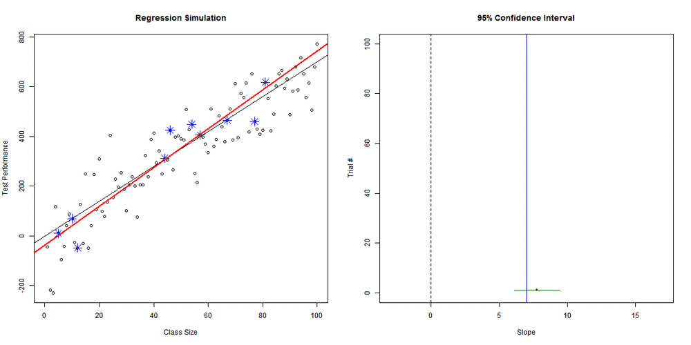
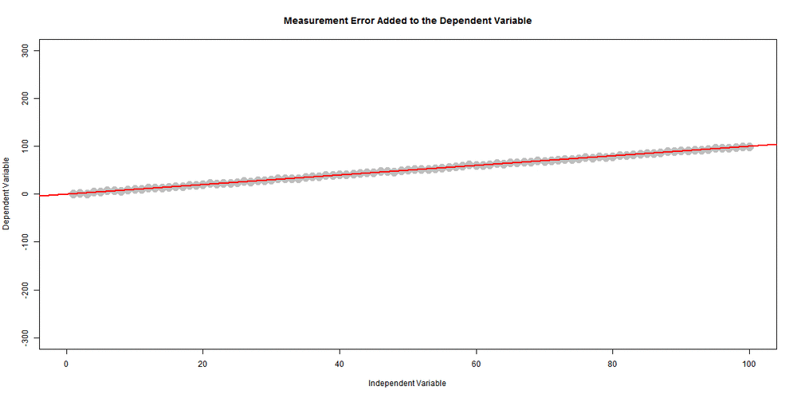
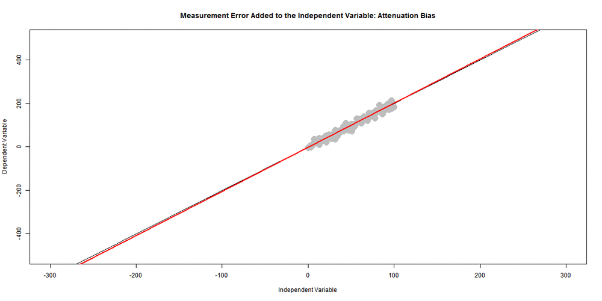
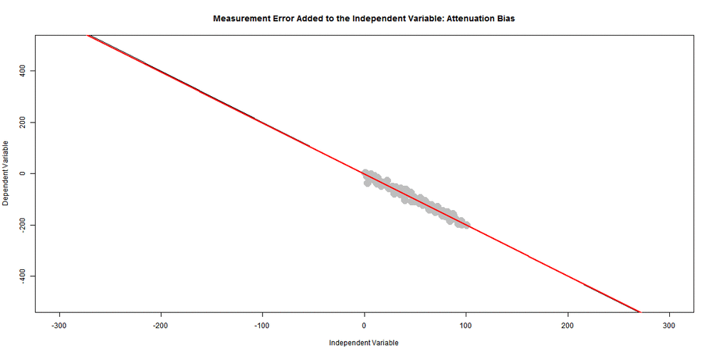

# Regression Simulations

This tutorial contains regression simulations of basic components of the regression model: standard errors of the slope, confidence intervals of the slope, demonstration of statistical significance, demonstration of the impact of measurement error on regression models, and the impact of omitted variable bias in regression analysis. 

It was inspired by the [sampling distribution of the mean](http://onlinestatbook.com/stat_sim/sampling_dist/) simulations from the Rice Virtual Lab in Statistics, but I could find nothing similar to explain the mechanics of important regression concepts.


## Run the R Program

Scripts are written in R. To run these examples in class, you need to source the following code (or download the scripts from this repository):

~~~r

source( "https://raw.githubusercontent.com/lecy/regression-simulations/master/confIntervalOfSlope.R" )
source( "https://raw.githubusercontent.com/lecy/regression-simulations/master/createSample.R" )
source( "https://raw.githubusercontent.com/lecy/regression-simulations/master/sampDistOfSlope.R" )
source( "https://raw.githubusercontent.com/lecy/regression-simulations/master/sizeOfBias.R" )
~~~


## TAKE A SAMPLE AND DRAW THE SLOPE

Demonstrates the drawing of a sample of given size from the population (the population is 100 in this case, so sample sizes up to 100 are valid). 

The function draws the sample, draws the true regression slope, then draws the slope calculated from the sample. After running the function click on the graphing window to add each step. It will wait for you to click for each step so that you have time to explain concepts to the class.

~~~r
	createSample( 10 )  # run then click on graphics window to start

	createSample( 25 )
~~~




## SAMPLING DISTRIBUTION OF SLOPE

This function performs the same operation as the createSample function above, but it repeatedly draws samples from the population and creates a distribution of the observed slopes. This is a demonstration of the standard error of the slope that results from variance in sampling.

The argument `slowSim=T` requires you to click on the graphing window for each new sample. It is useful to explain what is happening at first, but it takes a while to create a distribution this way.

~~~r
	sampDistOfSlope( num.trials=1000, samp.size=10, slowSim=F )


	sampDistOfSlope( num.trials=1000, samp.size=50, slowSim=F )


	sampDistOfSlope( num.trials=1000, samp.size=75, slowSim=F )
~~~


## CONFIDENCE INTERVALS FOR A SLOPE ESTIMATE

We take repeated samples from a population of 100 individuals. The slope and 95% confidence intervals are drawn for each sample and plotted on the right. Assume data is from an experiment where X represents the dosage and Y represents the response, so we can interpret the slope as a proper "effect".

Statistical significance can be determined by whethe the confidence interval contains the null hypothesis (slope = 0). If it does the interpretation is that we cannot tell if the treatment has a positive or a negative impact on the outcome, so we should not be confident about the impact of the treatment (the point estimate of the slope).

We want understand the relationships between four things:
* Sample size
* Effect size (slope)
* Confidence intervals
* Statistical significance

### Base Case

```r
	confIntervalOfSlope( num.trials=100, samp.size=10, effect.size=3, slowSim=T )
```	

Demonstration of 95% confidence intervals. Approximately 95 out of 100 samples will result in confidence intervals that contain the true slope. Note, if a confidence interval contains zero, the slope is not statistically significant at the alpha=0.05 level. 


We would not have a lot of comfort with this research design because even though we know the program has an impact (because we have the full population data to confirm) if we use a sample of 10 then we achieve significance only about half of the time, even though our estimates are unbiased. This concept is called statistical power.

### Increase Sample Size

```r
	# One way to ensure statistical significance - increase sample size
	confIntervalOfSlope( num.trials=100, samp.size=75, effect.size=3, slowSim=F )
```

If we want to increase the statistical power to ensure that we have more confidence in our results (achieve statistical significance) we can increase the sample size from 10 to 25. Notice how much smaller the confidence intervals become.




### Larger Effects Need Smaller Samples

Alternatively, although we cannot increase the effect size, it is useful to note that when the impact of the intervention is larger a smaller sample size is necessary to detect effects.

```r
	# keep small sample, increase effect size
	confIntervalOfSlope( num.trials=100, samp.size=10, effect.size=7, slowSim=F )
```




## RANDOM MEASUREMENT ERROR


### Measurement Error added to the DV

Measurement error in the dependent variable increases the amount of variance there is to explain, but does not impact the correlation between the DV and IVs, therefore does not change the slope (on average). 

The result is to increase the standard error of all regression coefficients without introducing bias into the model.

~~~r

# Visual representation of add measurement error to the DV

slopes1 <- NULL

x <- 1:100 

for( i in 1:1000 )
{

	z <- x + rnorm(100, 0, i/10)
	plot( x, z, xlim= c(0,100), ylim=c(-300, 300 ), pch=19, col="gray" )
	abline( a=0, b=1 )
	r1 <- lm( z ~ x )
	abline( a= r1$coefficients[1], b= r1$coefficients[2], col="red", lwd=2 )

	slopes1[i] <- r1$coefficients[2]

}

~~~




### Measurement Error Added to the IV

Measurement error added to the independent variable X does bias the slope, but in a very specific way. It increases the variance of X, but does not change the correlation between X and Y, and therefore moves the slope closer to zero since the slope is defined as ~ cov(x,y) / var(x).

This is called attenuation bias.

Since the variance of X increases, this also decreases the standard error of the slope coefficient.

~~~r

## POSITIVE SLOPE
   
slopes2 <- NULL

for( i in 1:1000 )
{

	x <- 1:100 
	z <- x + rnorm(100, 0, i/10)
	y <- 2*x + 10*rnorm(100)

	r2 <- lm( y ~ z )

	plot( z, y, xlim= c(-300,300), ylim=c(-500, 500 ), pch=19, col="gray"  )
	abline( a=0, b=2 )
	abline( a= r2$coefficients[1], b= r2$coefficients[2], col="red", lwd=2 )

	# slopes2[i] <- r2$coefficients[2]

}

~~~




~~~r

## NEGATIVE SLOPE

slopes2 <- NULL

for( i in 1:1000 )
{

	x <- 1:100 
	z <- x + rnorm(100, 0, i/10)
	y <- -2*x + 10*rnorm(100)

	r2 <- lm( y ~ z )

	plot( z, y, xlim= c(-300,300), ylim=c(-500, 500 ), pch=19, col="gray"  )
	abline( a=0, b=-2 )
	abline( a= r2$coefficients[1], b= r2$coefficients[2], col="red", lwd=2 )

	# slopes2[i] <- r2$coefficients[2]

}

~~~




## OMITTED VARIABLE BIAS

In this simulation we examine two models:

y = b0 + b1*x1 + b2*x2  [full model]

y = b0 + b1*x1  [naive model because we don't know about x2]

The question is, when will the naive model behave similar to the full (true) model?

Here we iterate through scenarios, starting with a strong positive correlation between X1 and X2, going to zero correlation, and finishing with a strong negative correlation between X1 and X2.

When the correlation between X1 and X2 is high, the slope between X1 and Y is impact. When the correlation between X1 and X2 is low, there is minimal effect (bias). 

Increasing the sample size does NOT mitigate bias.

~~~r

	# First show the bias in the slopes

	sizeOfBias( num.trials=500, samp.size=25, corr.strength=10, confInt=F )

	# Then show what the confidence intervals would look like

	sizeOfBias( num.trials=500, samp.size=25, corr.strength=10, confInt=T )

	# Does increasing the sample size fix bias?

	sizeOfBias( num.trials=500, samp.size=75, corr.strength=10, confInt=T )

~~~


## Create Animated GIF of Simulations

The package 'animation' provides a nice way to create animated GIFs from the simulation functions. These can be embedded in power points or used on websites.

The program ImageMagick must be installed on your machine.

http://www.imagemagick.org/script/index.php

~~~r

# install.packages( "animation" )

library( animation )

# copy the path to the convert.exe file in your programs folder
ani.options( convert = 'C:/Program Files/ImageMagick-6.9.2-Q16/convert.exe' )

saveGIF( expr={ confIntervalOfSlope( num.trials=100, samp.size=10, effect.size=3, slowSim=F ) }, 
         movie.name = "brownian_motion.gif", 
         interval = 0.1, 
         nmax = 100, 
         ani.width = 1200,
         ani.height = 600
       )

~~~

Alternatively, you can create a bunch of .png image files using a loop, then use a website like this to create the animation for you:

http://gifmaker.me/


